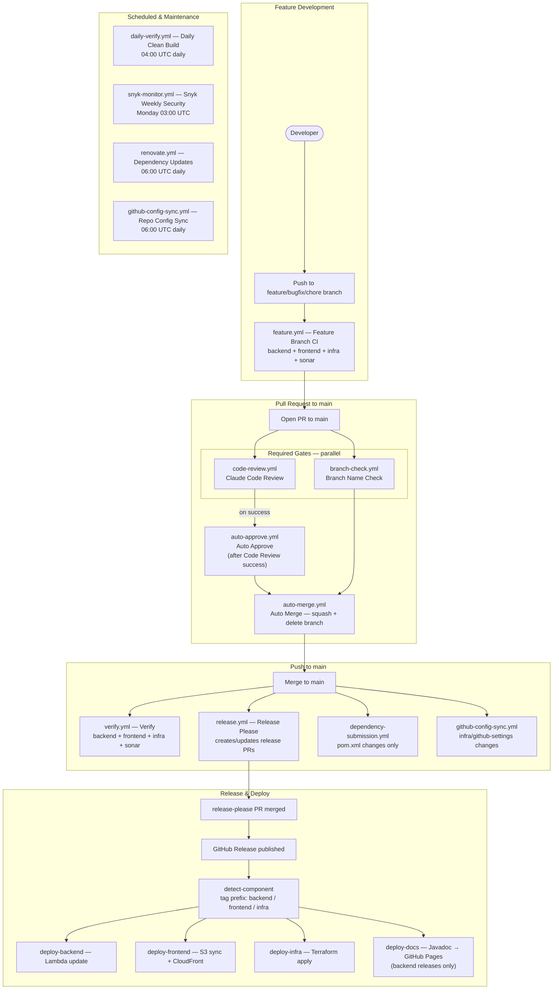

# GitHub Actions Workflows

MindTrack uses 13 GitHub Actions workflows organised into three categories:

- **Development** — run on every push to feature/bugfix/chore branches
- **PR Gates** — required checks that block merging until they pass
- **Scheduled & Maintenance** — automated housekeeping and security scans

The [lifecycle diagram](#workflow-lifecycle-diagram) below shows how all workflows connect from a developer push through to deployment.

---

## Workflow Lifecycle Diagram

---

## Core Development Workflows

### Feature Branch CI (`feature.yml`)

**Trigger:** Push to `feature/**`, `bugfix/**`, `chore/**`, or `renovate/**`; also on pull_request to `main`
**Purpose:** Validate every code change before it can be merged.

Runs backend build & test, frontend lint/test/build, and Terraform validation in parallel. The `sonar` job runs after either backend or frontend succeeds (OR condition — more lenient than `verify.yml`). Path filters skip jobs when their directory has no changes (on push; always runs on PR).

| Job | Steps |
|-----|-------|
| `backend` | Checkout → Java 21 → `mvn verify -B` → upload JaCoCo coverage |
| `frontend` | Checkout → Node 20 → `npm ci` → lint → unit tests + coverage → build |
| `infra` | Checkout → Terraform fmt/init/validate → tflint → tfsec (soft-fail) |
| `sonar` | Download coverage artifacts → SonarCloud scan (continue-on-error) |

---

### Verify (`verify.yml`)

**Trigger:** Push to `main`
**Purpose:** Full verification after every merge to main — no path filtering, all jobs always run.

Identical steps to `feature.yml` but stricter: the `sonar` job requires **both** `backend-verify` AND `frontend-verify` to succeed (AND condition).

| Job | Steps |
|-----|-------|
| `backend-verify` | Checkout → Java 21 → `mvn verify -B` → upload coverage |
| `frontend-verify` | Checkout → Node 20 → `npm ci` → lint → unit tests → build |
| `infra-verify` | Checkout → Terraform fmt/init/validate → tflint → tfsec |
| `sonar` | Download coverage → SonarCloud scan (requires both verify jobs to pass) |

---

## Pull Request Gates (Required)

Both workflows are **required status checks** — a PR cannot merge until both pass.

### Branch Name Check (`branch-check.yml`)

**Trigger:** PR to `main` (opened, synchronize, reopened)
**Purpose:** Enforce the `{type}/{issue-id}-{description}` branch naming convention.

Validates the PR head branch against the pattern `^(feature|bugfix|chore|docs|test|refactor|ci|infra|style|perf|build)/[0-9]+-[a-z0-9-]+$`. Renovate and Dependabot branches are exempt.

| Job | Steps |
|-----|-------|
| `check` | Validate branch name against regex pattern |

---

### Code Review (`code-review.yml`)

**Trigger:** PR to `main` (opened, synchronize, reopened)
**Purpose:** Claude posts a structured code review comment on every PR.

Uses `anthropics/claude-code-action@v1` with a custom prompt that checks correctness, security (OWASP Top 10), code conventions, test coverage, and performance. Review is posted as a single PR comment grouped by severity (Critical → High → Medium → Low).

| Job | Steps |
|-----|-------|
| `review` | Checkout (full history) → Run Claude Code Review action |

---

## Pull Request Automation

### Auto Approve (`auto-approve.yml`)

**Trigger:** `workflow_run` — fires when the `Code Review` workflow completes
**Purpose:** Automatically approve the PR after a successful automated code review.

Uses the `workflow_run` event (asynchronous) to look up the PR by head SHA and submit a GitHub approval. Only fires when the Code Review workflow concluded with `success`.

| Job | Steps |
|-----|-------|
| `approve` | Look up PR by head SHA → `gh pr review --approve` |

---

### Auto Merge (`auto-merge.yml`)

**Trigger:** PR opened or reopened to `main`
**Purpose:** Enable squash auto-merge so the PR merges automatically once all required checks pass.

Runs `gh pr merge --auto --squash --delete-branch` immediately when a PR is opened. Actual merge is deferred until branch protection requirements are satisfied.

| Job | Steps |
|-----|-------|
| `enable-auto-merge` | `gh pr merge --auto --squash --delete-branch` |

---

## Release & Deploy

### Release (`release.yml`)

**Trigger:** Push to `main`
**Purpose:** release-please bot creates or updates release PRs based on Conventional Commits.

Backend, frontend, and infra are versioned independently. The workflow outputs `releases_created` and per-component `release_created`/`tag_name` flags consumed by `deploy.yml`.

| Job | Steps |
|-----|-------|
| `release-please` | `googleapis/release-please-action@v4` with monorepo config |

---

### Deploy (`deploy.yml`)

**Trigger:** GitHub Release published
**Purpose:** Deploy the released component to AWS production.

Reads the release tag prefix (`backend-*`, `frontend-*`, `infra-*`) to determine which component to deploy. Each deploy job runs only for its component.

| Job | Steps |
|-----|-------|
| `detect-component` | Parse tag name → set `component` output |
| `deploy-backend` | Java 21 → `mvn package -DskipTests` → AWS OIDC → Lambda update-function-code |
| `deploy-frontend` | Node 20 → `npm ci` → build (with Sentry/GA vars) → AWS OIDC → S3 sync → CloudFront invalidation |
| `deploy-infra` | AWS OIDC → Terraform init/plan/apply (`prod.tfvars`) |
| `deploy-docs` | Java 21 → `mvn javadoc:javadoc` → GitHub Pages deploy (**backend releases only**) |

---

## Scheduled & Maintenance

### Daily Clean Build (`daily-verify.yml`)

**Trigger:** Daily at `04:00 UTC` (`0 4 * * *`); manual (`workflow_dispatch`)
**Purpose:** Catch dependency drift and snapshot resolution failures overnight.

Runs `mvn verify -U -B` (force-update snapshots) with **no Maven cache** — intentional to exercise a clean resolver every day. Frontend and infra verification also run without caches.

| Job | Steps |
|-----|-------|
| `backend` | Java 21 (no cache) → `mvn verify -U -B` |
| `frontend` | Node 20 (no cache) → `npm ci` → lint → unit tests → build |
| `infra` | Terraform fmt/init/validate → tflint → tfsec |

---

### Snyk Weekly Security (`snyk-monitor.yml`)

**Trigger:** Every Monday at `03:00 UTC` (`0 3 * * 1`); manual
**Purpose:** Weekly deep security scan and continuous monitoring via Snyk.

Tests both backend (`pom.xml`) and frontend (`package.json`) at `--severity-threshold=high`. Gracefully handles Snyk free-tier test limits (exits 0 with a warning rather than failing the build). Then runs `snyk monitor` to register snapshots in the Snyk dashboard.

| Job | Steps |
|-----|-------|
| `snyk` | Java 21 + Node 20 → Snyk test backend → Snyk test frontend → Snyk monitor backend → Snyk monitor frontend |

---

### Renovate (`renovate.yml`)

**Trigger:** Daily at `06:00 UTC` (`0 6 * * *`); manual
**Purpose:** Renovate bot scans for outdated dependencies and opens update PRs.

Uses `secrets.GH_CONFIG_TOKEN` (a PAT) rather than the default `GITHUB_TOKEN` because Renovate needs elevated permissions to create branches and PRs. Config is read from `renovate.json` in the repo root.

| Job | Steps |
|-----|-------|
| `renovate` | `renovatebot/github-action@v46.1.3` with `GH_CONFIG_TOKEN` |

---

### Dependency Submission (`dependency-submission.yml`)

**Trigger:** Push to `main` when `backend/pom.xml` or any `backend/**/pom.xml` changes
**Purpose:** Submit the Maven dependency graph to GitHub for Dependabot alerts.

Uses the `advanced-security/maven-dependency-submission-action` to populate the GitHub Dependency Graph, enabling Dependabot security alerts for the backend.

| Job | Steps |
|-----|-------|
| `submit` | Java 21 → `advanced-security/maven-dependency-submission-action@v5` |

---

### GitHub Config Sync (`github-config-sync.yml`)

**Trigger:** Push to `main` on `infra/github-settings/**` or `infra/modules/github/**`; daily at `06:00 UTC`; manual
**Purpose:** Apply Terraform to keep GitHub repository settings (branch protection, required checks, labels) in sync with code.

Reuses the repository `GH_CONFIG_TOKEN` secret for GitHub provider auth and the `AWS_ROLE_ARN` Actions variable for OIDC access to the Terraform backend. Runs Terraform plan + apply against the `infra/github-settings/` root module.

| Job | Steps |
|-----|-------|
| `sync` | AWS OIDC auth → Terraform setup → Terraform init/plan/apply |

---

## Secrets & Variables Reference

| Name | Type | Used by | Purpose |
|------|------|---------|---------|
| `ANTHROPIC_API_KEY` | Secret | `code-review.yml` | Claude API key for automated PR review |
| `GH_CONFIG_TOKEN` | Secret | `renovate.yml`, `github-config-sync.yml` | GitHub PAT for Renovate and GitHub settings Terraform |
| `SENTRY_AUTH_TOKEN` | Secret | `deploy.yml` | Frontend Sentry release/source-map upload |
| `SNYK_TOKEN` | Secret | `feature.yml`, `verify.yml`, `snyk-monitor.yml` | Snyk authentication token |
| `SONAR_TOKEN` | Secret | `feature.yml`, `verify.yml` | SonarCloud analysis token |
| `GITHUB_TOKEN` | Built-in | Most workflows | GitHub-provided token (auto-injected) |
| `AWS_ROLE_ARN` | Variable | `deploy.yml`, `github-config-sync.yml` | IAM role for OIDC-based AWS workflows |
| `FRONTEND_BUCKET` | Variable | `deploy.yml` | S3 bucket name for frontend assets |
| `CLOUDFRONT_DISTRIBUTION_ID` | Variable | `deploy.yml` | CloudFront distribution for cache invalidation |
| `SENTRY_ORG` | Variable | `deploy.yml` | Sentry organization slug for frontend uploads |
| `SENTRY_PROJECT_FRONTEND` | Variable | `deploy.yml` | Frontend Sentry project slug |
| `VITE_SENTRY_DSN` | Variable | `feature.yml`, `deploy.yml` | Sentry DSN injected at frontend build time |
| `VITE_SENTRY_RELEASE` | Derived | `deploy.yml` | Frontend release identifier from the GitHub release tag |
| `VITE_SENTRY_TRACES_SAMPLE_RATE` | Variable | `feature.yml`, `deploy.yml` | Sentry traces sample rate |
| `VITE_APP_ENV` | Variable | `feature.yml` | App environment tag for frontend build |
| `VITE_GA_MEASUREMENT_ID` | Variable | `feature.yml`, `deploy.yml` | Google Analytics 4 measurement ID |

---

## Required Status Checks

The following checks are configured as required in branch protection and must pass before a PR can merge to `main`:

| Check | Workflow | Notes |
|-------|----------|-------|
| `Branch Name Check` | `branch-check.yml` | Validates `{type}/{issue-id}-{description}` format |
| `Code Review` | `code-review.yml` | Claude posts structured review; triggers auto-approve on success |

`auto-merge.yml` activates squash auto-merge on PR open; once both required checks pass and the PR is approved (by `auto-approve.yml`), GitHub merges automatically.
