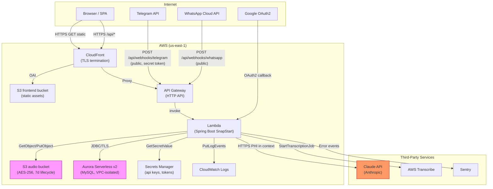

# MindTrack Threat Model & SOC2 Compliance Audit

**Date:** 2026-03-07
**Scope:** Full codebase audit — backend, frontend, infrastructure, CI/CD
**Methodology:** STRIDE threat modeling + SOC2 Trust Service Criteria gap analysis
**Classification:** Internal — Security Sensitive

---

## Executive Summary

MindTrack processes Protected Health Information (PHI) and Personally Identifiable Information (PII) including psychiatric interview notes, audio transcriptions, journal entries, medication changes, mood tracking, and therapist-patient relationships. A breach of this data would cause severe harm to users and expose the organization to regulatory and reputational risk.

This audit identified **6 Critical**, **13 High**, **16 Medium**, and **7 Low** findings. The most severe issues include an IDOR vulnerability exposing any user's mental health coaching conversations, a CORS wildcard on API Gateway, JWT delivered via URL query parameter, a hardcoded secret committed to the repo, missing database deletion protection, absent HTTP security headers, and no human code review gate before production deploy.

**Remediation status (2026-03-08):** 6/6 Critical fixed · 8/13 High fixed, 4 deferred · 11/16 Medium fixed, 4 deferred · 3/7 Low fixed, 4 deferred.

**Overall SOC2 readiness: In progress.** All Critical findings have been remediated (PRs #97, #99). High-severity deferred items (H-4, H-5, H-6, H-8) have documented remediation plans and are queued for dedicated sprints. Engaging an auditor is now contingent only on deferred High findings being closed.

---

## Scope

### Modules Reviewed

| Component | Files |
|-----------|-------|
| Backend — auth | `auth/config/SecurityConfig.java`, `JwtService.java`, `OAuth2LoginSuccessHandler.java`, `JwtAuthenticationFilter.java`, `AuthController.java` |
| Backend — interview | `InterviewController.java`, `InterviewService.java` |
| Backend — therapist | `TherapistController.java`, `TherapistService.java` |
| Backend — messaging | `TelegramWebhookController.java`, `MessagingService.java` |
| Backend — AI | `ContextBuilder.java`, `ClaudeApiClient.java`, `ConversationService.java` |
| Backend — admin | `AdminController.java`, `AdminService.java` |
| Database schema | `V1__initial_schema.sql`, `V2__seed_admin_user.sql` |
| Infrastructure | `infra/modules/rds/`, `iam/`, `cloudfront/`, `s3/`, `api-gateway/`, `secrets/`, `monitoring/` |
| CI/CD | All `.github/workflows/*.yml` |
| Configuration | `application.yml`, `application-prod.yml` |

### Data Assets — Sensitivity Classification

| Asset | Table | Classification | Notes |
|-------|-------|---------------|-------|
| Psychiatric interview notes | `interviews.notes` | PHI — Highly Sensitive | Includes medication changes, recommendations |
| Audio transcriptions | `interviews.transcription_text` | PHI — Highly Sensitive | Full session transcript |
| Journal entries | `journal_entries.content` | PHI — Sensitive | Free-text mental health journaling |
| Mood scores | `journal_entries.mood`, `interviews.mood_before/after` | PHI — Sensitive | Quantified mood data |
| Goals and milestones | `goals`, `milestones` | PHI — Sensitive | Linked to therapy outcomes |
| AI conversation history | `messages.content` | PHI — Sensitive | Mental health coaching messages |
| Therapist-patient relationships | `therapist_patients` | PHI — Sensitive | Reveals mental health treatment |
| Email address | `users.email` | PII | Google OAuth identity |
| Telegram chat ID | `user_profiles.telegram_chat_id` | PII | Messaging identifier |
| WhatsApp phone number | `user_profiles.whatsapp_number` | PII | Phone number |
| Audio files | S3 audio bucket | PHI — Highly Sensitive | 7-day lifecycle, AES-256 encrypted |

---

## Data Flow Diagram



**Trust boundaries:**
1. Internet → CloudFront (TLS, no authentication)
2. CloudFront → API Gateway → Lambda (API authentication via JWT)
3. Webhook endpoints (public, optional secret token)
4. Lambda → Claude API (PHI crosses organizational boundary — **highest risk**)
5. Lambda → Aurora (VPC-internal, security group restricted)

---

## STRIDE Threat Analysis

### Trust Boundary 1: Browser → OAuth2 Login Flow

| Threat | STRIDE | Description | Current Control | Gap |
|--------|--------|-------------|----------------|-----|
| Token interception in URL | **I** Information Disclosure | JWT appended as query param on redirect; exposed in browser history, server logs, Referrer headers | URL encoding only | **No mitigation** — see C-1 |
| JWT secret compromise | **S** Spoofing | Attacker with repo access uses hardcoded default secret to forge any user token | Environment variable override | Default is in repo — see C-2 |
| OAuth state bypass | **T** Tampering | CSRF on OAuth flow | Spring Security OAuth2 state param | Adequate |
| Session fixation | **S** Spoofing | Reuse of pre-auth session | Stateless JWT (no server sessions) | Adequate |

### Trust Boundary 2: API Endpoints (JWT-authenticated)

| Threat | STRIDE | Description | Current Control | Gap |
|--------|--------|-------------|----------------|-----|
| Horizontal privilege escalation | **E** Elevation | User A accesses User B's mental health data | `findByIdAndUserId()` in all repos | Adequate for user data; therapist access validated via relationship table |
| Self-promotion to THERAPIST | **E** Elevation | Any user calls `PATCH /api/auth/me/role` with `{"role":"THERAPIST"}` | Pattern validation excludes ADMIN | **No verification gate** — see H-3 |
| Token replay after account disable | **S** Spoofing | Disabled account's JWT still valid for up to 24h | Account `enabled` flag | JWT cannot be revoked — see M-10 |
| Brute force / credential stuffing | **D** DoS | Repeated requests to API endpoints | None | **No rate limiting** — see H-5 |
| Internal ID leakage in errors | **I** Info Disclosure | Error messages include `therapistId` and `patientId` values | None | See M-4 |

### Trust Boundary 3: Public Webhook Endpoints

| Threat | STRIDE | Description | Current Control | Gap |
|--------|--------|-------------|----------------|-----|
| Fake Telegram messages | **S** Spoofing | Attacker sends forged webhook to trigger AI calls for any known user | Optional webhook secret token | Secret is not enforced if unconfigured — see H-2 |
| WhatsApp webhook forgery | **S** Spoofing | Same attack via WhatsApp endpoint | None visible | WhatsApp HMAC signature not validated |
| Webhook flood (DoS) | **D** DoS | High-volume fake requests consume Lambda concurrency and Claude API budget | None | No rate limiting on webhook path |

### Trust Boundary 4: Lambda → Claude API (PHI Export)

| Threat | STRIDE | Description | Current Control | Gap |
|--------|--------|-------------|----------------|-----|
| PHI sent to third party | **I** Info Disclosure | Psychiatric recommendations, mood data, goal titles sent as Claude API system prompt | None | **No user consent gate** — see H-6 |
| Data retention at Anthropic | **I** Info Disclosure | Anthropic may store/use prompts per their policy | Anthropic's own data policies | No DPA or data processing agreement visible in code |
| Prompt injection | **T** Tampering | User-controlled content in messages could manipulate AI behavior | `Never provide medical diagnoses` in system prompt | Partial; no sanitization of user messages |

### Trust Boundary 5: Infrastructure / Data at Rest

| Threat | STRIDE | Description | Current Control | Gap |
|--------|--------|-------------|----------------|-----|
| Database accidental deletion | **D** DoS / **T** Tampering | Aurora cluster destroyed with no recovery | None | No deletion_protection, no final snapshot — see C-3 |
| Insufficient backup retention | **D** DoS | Data corruption undetected beyond retention window | Aurora default (1 day) | Need 30 days — see H-7 |
| S3 audio public exposure | **I** Info Disclosure | Audio recordings publicly accessible | Public access block enabled | Adequate |
| Lambda execution over-privilege | **E** Elevation | Lambda can access all Transcribe jobs, all CloudWatch log groups | Resource `"*"` on some actions | See L-5 |
| Supply chain attack via CI | **T** Tampering | Malicious GitHub Action executes with access to prod secrets | Tag pinning | Actions use mutable tags, not SHA — see H-1 |

---

## Vulnerability Findings

### CRITICAL

---

#### C-1: JWT Token Exposed in OAuth Redirect URL

- **Status: FIXED — PR #97**
- **Severity:** Critical
- **SOC2 Controls:** CC6.6 (Logical access — secure transmission)
- **File:** `backend/src/main/java/com/mindtrack/auth/config/OAuth2LoginSuccessHandler.java:54`
- **Description:** After successful Google OAuth2 login, the server redirects to `{frontendUrl}/login?token={jwt}`. The JWT token is appended as a URL query parameter. This exposes the token in:
  - Browser history (all devices where the user logs in)
  - Web server and proxy access logs
  - `Referer` headers sent on subsequent requests to third parties (e.g., Google Analytics, Sentry)
  - CloudFront access logs
- **Impact:** Any attacker or insider with access to logs can extract valid session tokens for any user and impersonate them.
- **Recommended Fix:** Deliver the token via an HTTP-only cookie set on the redirect, or redirect to a page that exchanges a short-lived one-time code for the JWT via a POST request (PKCE-style handoff).
- **GitHub Issue:** `[Security][Critical] JWT token exposed in OAuth redirect URL`

---

#### C-2: Hardcoded JWT Secret Fallback in Source Code

- **Status: FIXED — PR #97**
- **Severity:** Critical
- **SOC2 Controls:** CC6.1 (Logical access — authentication credentials)
- **File:** `backend/src/main/resources/application.yml:61`
- **Description:** `jwt-secret: ${JWT_SECRET:default-dev-secret-key-change-in-prod-256bit!}` — if the `JWT_SECRET` environment variable is not set, the application uses the literal default string as the HMAC-SHA signing key. This string is committed to the repository.
- **Impact:** Any attacker who reads the repository can forge valid JWTs for any user ID and role (including ADMIN) if `JWT_SECRET` is ever missing from the production Lambda environment.
- **Recommended Fix:** Remove the default value entirely. Use `${JWT_SECRET}` with no fallback so the application fails to start if the secret is absent. Rotate the current secret immediately if it may have been used in production.
- **GitHub Issue:** `[Security][Critical] Hardcoded JWT secret fallback in application.yml`

---

#### C-3: Aurora Has No Deletion Protection and Skips Final Snapshot

- **Status: FIXED — PR #99**
- **Severity:** Critical
- **SOC2 Controls:** A1.2 (Availability — environmental protections), CC9.1 (Risk management — business continuity)
- **File:** `infra/modules/rds/main.tf:50-73`
- **Description:** The Aurora cluster has `skip_final_snapshot = true` and no `deletion_protection = true`. If the cluster is accidentally deleted (e.g., via `terraform destroy`, a misconfigured Terraform run, or an AWS console mistake), all mental health data is permanently lost with no recovery path.
- **Impact:** Catastrophic, irreversible data loss. Regulatory breach. No ability to restore.
- **Recommended Fix:** Set `deletion_protection = true` and `skip_final_snapshot = false` (with a `final_snapshot_identifier`). Also set `backup_retention_period = 30`.
- **GitHub Issue:** `[Infra][Critical] Aurora has no deletion protection and skips final snapshot`

---

#### C-4: No HTTP Security Response Headers on CloudFront

- **Status: FIXED — PR #99**
- **Severity:** Critical
- **SOC2 Controls:** CC6.6 (Logical access — secure transmission and boundary protection)
- **File:** `infra/modules/cloudfront/main.tf`
- **Description:** No `aws_cloudfront_response_headers_policy` is attached to the distribution. The following headers are absent from all responses:
  - `Strict-Transport-Security` (HSTS) — browsers may fall back to HTTP
  - `Content-Security-Policy` — no XSS protection
  - `X-Frame-Options` — clickjacking attacks possible
  - `X-Content-Type-Options` — MIME sniffing attacks
  - `Referrer-Policy` — JWT tokens in URLs (C-1) leak via Referer to third-party scripts
  - `Permissions-Policy` — no restriction on browser APIs
- **Impact:** XSS attacks, clickjacking, token leakage via Referer, MIME confusion attacks.
- **Recommended Fix:** Create an `aws_cloudfront_response_headers_policy` resource with a strict security headers configuration and attach it to the `default_cache_behavior`.
- **GitHub Issue:** `[Infra][Critical] CloudFront missing security response headers policy`

---

### HIGH

---

#### H-1: GitHub Actions Pinned to Mutable Version Tags

- **Status: FIXED — PR #106**
- **Severity:** High
- **SOC2 Controls:** CC8.1 (Change management — secure SDLC)
- **Files:** All `.github/workflows/*.yml`
- **Description:** All `uses:` directives reference mutable version tags (e.g., `actions/checkout@v4`, `aws-actions/configure-aws-credentials@v6`, `SonarSource/sonarcloud-github-action@v5`). If any upstream action repository is compromised, an attacker can push malicious code under the same tag. The next CI run will execute that code with access to all repository secrets (`ANTHROPIC_API_KEY`, `SONAR_TOKEN`, `SNYK_TOKEN`, AWS credentials).
- **Recommended Fix:** Pin each action to its current commit SHA (e.g., `actions/checkout@11bd71901bbe5b1630ceea73d27597364c9af683`). Use Dependabot or Renovate to automate SHA updates.
- **GitHub Issue:** `[CI][High] Pin all GitHub Actions to commit SHA`

---

#### H-2: Telegram Webhook Secret Not Enforced

- **Status: FIXED — PR #101**
- **Severity:** High
- **SOC2 Controls:** CC6.3 (Logical access — boundary protection)
- **File:** `backend/src/main/java/com/mindtrack/messaging/controller/TelegramWebhookController.java:57-63`
- **Description:** Webhook secret validation is conditional: `if (configuredSecret != null && !configuredSecret.isBlank())`. If `messaging.telegram.webhook-secret` is not set in the environment, all POST requests to `/api/webhooks/telegram` are accepted without any verification.
- **Impact:** Attackers who know a user's Telegram chat ID can send forged messages that trigger AI coaching sessions on behalf of that user, consuming API budget and potentially misleading the AI with false data.
- **Recommended Fix:** Make the webhook secret required. Fail application startup if not configured. Similarly, validate the `X-Hub-Signature-256` HMAC on WhatsApp webhooks (not currently implemented at all).
- **GitHub Issue:** `[Security][High] Telegram webhook secret must be required, not optional`

---

#### H-3: Any User Can Self-Promote to THERAPIST Role

- **Status: FIXED — PR #101**
- **Severity:** High
- **SOC2 Controls:** CC6.3 (Logical access — access provisioning)
- **File:** `backend/src/main/java/com/mindtrack/auth/controller/AuthController.java:57-66`
- **Description:** `PATCH /api/auth/me/role` with body `{"role":"THERAPIST"}` allows any authenticated user to instantly become a THERAPIST. The THERAPIST role grants read access to linked patients' psychiatric interviews, journal entries, goals, and activities. While the therapist-patient relationship table (`therapist_patients`) controls which patients a therapist can see, there is no verification that the user is actually a licensed therapist before granting the role.
- **Impact:** Patients may be deceived into linking with fake "therapists." A malicious actor gains a privileged role without any vetting.
- **Recommended Fix:** Remove self-service THERAPIST promotion. THERAPIST role should require admin approval or an invite-based flow. At minimum, add an admin-approval step before the role is granted.
- **GitHub Issue:** `[Security][High] Self-service THERAPIST role requires verification gate`

---

#### H-4: Aurora Database Placed in Default VPC

- **Status: DEFERRED — requires dedicated VPC/subnet/NAT architecture; separate sprint**
- **Severity:** High
- **SOC2 Controls:** CC6.6 (Logical access — network segmentation)
- **File:** `infra/modules/rds/main.tf:14-15`
- **Description:** `data "aws_vpc" "default" { default = true }` — the Aurora cluster is placed in the AWS default VPC, which typically has public subnets with internet gateway routing. While the security group restricts ingress to the Lambda SG only, the default VPC is shared with any other AWS resources in the account and has weaker isolation guarantees than a dedicated VPC.
- **Recommended Fix:** Create a dedicated VPC with private subnets only (no internet gateway, NAT gateway for outbound only). Place Aurora in private subnets. This also removes the risk of misconfigured security groups accidentally exposing the database.
- **GitHub Issue:** `[Infra][High] Migrate Aurora to dedicated VPC`

---

#### H-5: No Rate Limiting on Any API Endpoint

- **Status: DEFERRED — requires API Gateway usage plan + Spring HandlerInterceptor design; separate sprint**
- **Severity:** High
- **SOC2 Controls:** CC6.1 (Authentication), CC7.1 (Threat detection)
- **Description:** No rate limiting is implemented at any layer — no Spring Security throttling, no API Gateway usage plan, no Lambda concurrency limits per client. The AI coaching endpoints (`POST /api/ai/chat`) call the Claude API on every request, making them particularly expensive targets for abuse.
- **Impact:** Credential stuffing attacks on OAuth endpoints, DoS via Lambda concurrency exhaustion, runaway Claude API bills from a single malicious user.
- **Recommended Fix:** Add an API Gateway usage plan with throttling (e.g., 100 req/s burst, 20 req/s steady). For AI endpoints specifically, add per-user rate limiting via a Spring `HandlerInterceptor` or AWS WAF rate-based rule.
- **GitHub Issue:** `[Security][High] Add API rate limiting`

---

#### H-6: PHI Sent to Third-Party Claude API Without Explicit User Consent

- **Status: DEFERRED — requires legal review (BAA/DPA), consent UI design, and data minimization sprint**
- **Severity:** High
- **SOC2 Controls:** CC2.2 (Communication of privacy policies), CC9.2 (Third-party risk management)
- **File:** `backend/src/main/java/com/mindtrack/ai/service/ContextBuilder.java:42-182`
- **Description:** The `buildSystemPrompt()` method aggregates psychiatric interview recommendations, mood scores, goal titles, and activity data and sends them to the Anthropic Claude API. No user consent mechanism is visible in the code. No Data Processing Agreement (DPA) reference or BAA (Business Associate Agreement) is tracked in the codebase.
- **Impact:** Transmission of PHI to a third-party AI provider without documented consent or a signed BAA may violate HIPAA (if US-based), GDPR (EU users), and SOC2 privacy criteria. If Anthropic's terms permit training on API inputs, this could expose sensitive mental health data.
- **Recommended Fix:** (1) Require explicit user consent before enabling AI coaching features, with a clear statement that their data will be sent to Anthropic. (2) Document and link the BAA/DPA with Anthropic. (3) Review Anthropic's zero-data-retention API option for sensitive use cases. (4) Implement data minimization — send the minimum context necessary.
- **GitHub Issue:** `[Privacy][High] Add user consent for PHI sent to Claude API`

---

#### H-7: Aurora Backup Retention Too Short

- **Status: FIXED — PR #99**
- **Severity:** High
- **SOC2 Controls:** A1.2 (Availability — backup and recovery)
- **File:** `infra/modules/rds/main.tf`
- **Description:** No `backup_retention_period` is set on the Aurora cluster. Aurora Serverless defaults to 1 day of automated backups. For a mental health application, 1 day is insufficient to detect and recover from silent data corruption, ransomware, or accidental bulk deletion.
- **Recommended Fix:** Set `backup_retention_period = 30` (30 days is the SOC2 / HIPAA-friendly minimum for sensitive health data). Also enable point-in-time recovery.
- **GitHub Issue:** `[Infra][High] Set Aurora backup_retention_period to 30 days`

---

#### H-8: No Structured Audit Log for Sensitive Data Access

- **Status: DEFERRED — requires Flyway migration + AuditService + schema design; separate sprint**
- **Severity:** High
- **SOC2 Controls:** CC7.2 (Monitoring — anomaly detection), CC4.1 (Monitoring — performance)
- **Description:** There is no `audit_logs` table in the database schema. Access to PHI (reading a psychiatric interview, viewing journal entries, therapist accessing patient data) is recorded only as `LOG.info(...)` application log lines to CloudWatch. These logs: (a) are not structured or queryable, (b) do not record what data was accessed, (c) are retained for the default CloudWatch retention period, (d) cannot be tampered with by application code — but also cannot answer "who accessed patient X's records between dates Y and Z?"
- **Impact:** Cannot demonstrate access control effectiveness to a SOC2 auditor. Cannot investigate potential data breaches. Cannot provide access logs to patients (right of access under GDPR).
- **Recommended Fix:** Add an `audit_logs` table with columns: `id`, `timestamp`, `actor_user_id`, `action` (READ/WRITE/DELETE), `resource_type`, `resource_id`, `patient_user_id`, `ip_address`, `channel`. Create an `AuditService` that writes to this table on every sensitive data access. Retention: 1 year minimum.
- **GitHub Issue:** `[Security][High] Add structured audit_logs table and service`

---

#### H-9: Build Pipelines Missing `mvn clean` and Terraform Clean Step

- **Status: FIXED — PR #82 (already in main)**
- **Severity:** High
- **SOC2 Controls:** CC8.1 (Change management — build integrity)
- **Files:** `.github/workflows/deploy.yml:50`, `feature.yml:39`, `verify.yml:27`, `daily-verify.yml:26`
- **Description:** Maven build steps use `mvn package` or `mvn verify` without a preceding `clean` phase. Stale compiled classes from a previous build cycle (e.g., from a cached Maven local repo layer) could be included in the deployment artifact. Similarly, Terraform init steps do not remove `.terraform/` directories before running, meaning cached provider plugins from a previous run may be used without re-verification. (Note: GitHub Actions runners are ephemeral, so this is lower risk in CI, but the pattern creates inconsistency with local builds and does not follow build hygiene best practices.)
- **Recommended Fix:** Change all Maven build steps to `mvn clean verify` / `mvn clean package`. Add `rm -rf .terraform` before each `terraform init` step. Document this in `CLAUDE.md`.
- **GitHub Issue:** `[CI][High] Add mvn clean and terraform clean to all build pipelines`

---

### MEDIUM

---

#### M-1: H2 Console Publicly Accessible

- **Status: FIXED — PR #102**
- **Severity:** Medium
- **SOC2 Controls:** CC6.3
- **File:** `backend/src/main/java/com/mindtrack/auth/config/SecurityConfig.java:50`
- **Description:** `.requestMatchers("/h2-console/**").permitAll()` — the H2 web console is accessible without authentication. If the `local` or `docker` profile is accidentally activated in a deployed environment, this exposes a full SQL console to the database with no authentication.
- **Recommended Fix:** Restrict H2 console access to localhost only (via `application-local.yml` firewall config) or remove the permit-all rule and gate it behind ADMIN role. Ensure the H2 console is disabled entirely in `application-prod.yml`.

---

#### M-2: CORS Allows All Request Headers

- **Status: FIXED — PR #102**
- **Severity:** Medium
- **SOC2 Controls:** CC6.6
- **File:** `backend/src/main/java/com/mindtrack/auth/config/SecurityConfig.java:69`
- **Description:** `config.setAllowedHeaders(List.of("*"))` permits any request header in cross-origin requests. Additionally, the allowed origins are only `localhost` addresses — production domain is not configured, meaning CORS will reject prod requests unless this is overridden in production config (not visible in `application-prod.yml`).
- **Recommended Fix:** Enumerate required headers explicitly (`Authorization`, `Content-Type`). Configure allowed origins from an environment variable so production domain is set at deploy time.

---

#### M-3: CSRF Disabled for All API Endpoints

- **Status: FIXED — PR #102** (documented with code comment)
- **Severity:** Medium
- **SOC2 Controls:** CC6.6
- **File:** `backend/src/main/java/com/mindtrack/auth/config/SecurityConfig.java:41`
- **Description:** `csrf.ignoringRequestMatchers("/api/**", "/h2-console/**")` disables CSRF for all API paths. For stateless JWT-based APIs this is acceptable because CSRF attacks require session cookies. However, this should be documented, and if the auth model ever changes to use cookies, this becomes critical.
- **Recommended Fix:** Add a code comment documenting why CSRF is disabled for the API. Consider using `csrf.disable()` only if truly stateless; the current partial disabling is unusual and could be confusing.

---

#### M-4: Exception Messages Leak Internal User IDs

- **Status: FIXED — PR #102**
- **Severity:** Medium
- **SOC2 Controls:** CC6.6
- **File:** `backend/src/main/java/com/mindtrack/therapist/service/TherapistService.java:299`
- **Description:** `throw new IllegalArgumentException("No active therapist-patient relationship for therapist " + therapistId + " and patient " + patientId)` — if this exception propagates to the HTTP response, it discloses internal numeric user IDs to the caller.
- **Recommended Fix:** Use a generic `AccessDeniedException` or a custom exception that maps to a 404/403 without including internal IDs. Add a `@ExceptionHandler` in a `@ControllerAdvice` class to sanitize all error responses.

---

#### M-5: PII Stored in Plaintext (Telegram Chat ID, WhatsApp Number)

- **Status: DEFERRED — requires KMS key setup + JPA AttributeConverter + Flyway migration; separate sprint**
- **Severity:** Medium
- **SOC2 Controls:** CC6.1
- **File:** `backend/src/main/resources/db/migration/V1__initial_schema.sql:51-52`
- **Description:** `telegram_chat_id VARCHAR(100)` and `whatsapp_number VARCHAR(20)` are stored as plaintext in the `user_profiles` table. If the database is compromised, these identifiers can be used to contact users or correlate their mental health status with their messaging accounts.
- **Recommended Fix:** Encrypt these fields using application-level encryption (e.g., Spring's `@Convert` with an `AttributeConverter` using AES-GCM and a KMS-managed key) or use Aurora column-level encryption.

---

#### M-6: Sensitive Tables Missing `created_by` / `updated_by` Audit Columns

- **Status: DEFERRED — fold into H-8 audit sprint (requires Flyway migration)**
- **Severity:** Medium
- **SOC2 Controls:** CC7.2
- **File:** `backend/src/main/resources/db/migration/V1__initial_schema.sql`
- **Description:** The `interviews`, `journal_entries`, `goals`, and `milestones` tables have `created_at` and `updated_at` timestamps but no `created_by` or `updated_by` columns. When a therapist creates or edits a patient's goal, there is no database-level record of who made that change.
- **Recommended Fix:** Add `created_by BIGINT` and `updated_by BIGINT` columns referencing `users.id` on all PHI tables. Populate these using Spring Data's `@CreatedBy` / `@LastModifiedBy` auditing support.

---

#### M-7: `tfsec` Runs with `soft_fail: true`

- **Status: FIXED — PR #105**
- **Severity:** Medium
- **SOC2 Controls:** CC8.1
- **File:** `.github/workflows/feature.yml:139`, `verify.yml:109`
- **Description:** `soft_fail: true` means tfsec security findings (HIGH, CRITICAL) never cause the workflow to fail. Infrastructure security misconfigurations can be merged without any automated gate.
- **Recommended Fix:** Remove `soft_fail: true`. Triage existing failures and add tfsec ignore annotations for accepted risks. Then enforce tfsec as a required status check.

---

#### M-8: Frontend Lint and SonarCloud Use `continue-on-error: true`

- **Status: FIXED — PR #105**
- **Severity:** Medium
- **SOC2 Controls:** CC8.1
- **File:** `feature.yml:73` (lint), `feature.yml:171` (SonarCloud), `verify.yml:54` (lint), `verify.yml:136` (SonarCloud)
- **Description:** Both frontend ESLint and SonarCloud analysis use `continue-on-error: true`, meaning security hotspots, lint errors, and code quality issues cannot block a PR from merging.
- **Recommended Fix:** Remove `continue-on-error: true` from lint and SonarCloud steps. Address current baseline issues, then enforce as blocking gates.

---

#### M-9: No CloudWatch Alarms for Security Events

- **Status: DEFERRED — requires SNS topic + PagerDuty/email alerting design; fold into observability sprint**
- **Severity:** Medium
- **SOC2 Controls:** CC7.1 (Threat detection and monitoring)
- **File:** `infra/modules/monitoring/` (no security alarms visible)
- **Description:** The monitoring module contains CloudWatch dashboards for Lambda and RDS performance but no metric filters or alarms for security events: repeated 401/403 responses, failed JWT validations, suspicious access patterns, or webhook abuse.
- **Recommended Fix:** Create CloudWatch metric filters on Lambda log groups for HTTP 401/403 status codes, JWT validation failures, and webhook secret validation failures. Set alarms that notify an SNS topic (→ email/PagerDuty) when thresholds are exceeded.

---

#### M-10: JWT Tokens Cannot Be Revoked

- **Status: DEFERRED — requires DB token-version claim or blocklist + refresh token mechanism; separate sprint**
- **Severity:** Medium
- **SOC2 Controls:** CC6.6
- **Files:** `JwtService.java`, `SecurityConfig.java`
- **Description:** JWTs are stateless with a 24-hour expiration. There is no token revocation mechanism. If an account is disabled via `PATCH /api/admin/users/{id}/enabled` (setting `enabled=false`), the user's existing JWT remains valid for the remainder of its 24-hour lifetime. Similarly, if a JWT is stolen, it cannot be invalidated.
- **Recommended Fix:** Add a token revocation check: either store a token version number in the database and include it in the JWT claim (bump on revoke), or maintain a small Redis/DynamoDB blocklist for explicitly revoked tokens. Reduce JWT expiry to 1 hour and implement refresh tokens.

---

### LOW

---

#### L-1: No Data Retention or Deletion Policy

- **Status: DEFERRED — requires privacy policy, delete-account endpoint, and jurisdiction decision**
- **Severity:** Low
- **SOC2 Controls:** CC4.1 (Privacy — data retention)
- **Description:** No scheduled job, TTL, or policy governs how long user data is retained after account closure. Mental health records accumulate indefinitely. This conflicts with GDPR's right to erasure and CCPA's deletion rights.
- **Recommended Fix:** Implement a data retention policy. Add a "delete my account" endpoint that cascades deletion of all user-linked PHI. Define retention periods per data type and document them in a Privacy Policy.

---

#### L-2: JWT Expiration 24 Hours, No Refresh Token

- **Status: DEFERRED — fold into M-10 refresh token sprint**
- **Severity:** Low
- **SOC2 Controls:** CC6.6
- **File:** `application.yml:62`
- **Description:** 24-hour JWT expiry with no refresh mechanism means stolen tokens are valid for up to 24 hours. The only remediation is to wait out the expiry.
- **Recommended Fix:** Reduce to 1-hour expiry. Implement refresh token rotation (long-lived, single-use, stored server-side as a hash).

---

#### L-3: No Geo-Restriction on CloudFront

- **Status: DEFERRED — requires jurisdiction decision**
- **Severity:** Low
- **SOC2 Controls:** CC6.6
- **File:** `infra/modules/cloudfront/main.tf:51-53`
- **Description:** `restriction_type = "none"` — the application is accessible from any country. If MindTrack is not operating in certain jurisdictions, blocking those regions reduces attack surface.
- **Recommended Fix:** If the application serves a specific geography, configure an allowlist or blocklist of countries. Evaluate regulatory requirements for data transfer to/from specific regions.

---

#### L-4: CloudFront Uses Default Certificate (No Custom Domain)

- **Status: DEFERRED — requires domain registration and ACM certificate provisioning**
- **Severity:** Low
- **SOC2 Controls:** CC6.7
- **File:** `infra/modules/cloudfront/main.tf:56-58`
- **Description:** `cloudfront_default_certificate = true` — the application is served on a `*.cloudfront.net` subdomain rather than a custom branded domain with an ACM certificate. HSTS preloading requires a custom domain.
- **Recommended Fix:** Register a domain, issue an ACM certificate, configure CloudFront with `viewer_certificate { acm_certificate_arn = ... ssl_support_method = "sni-only" }`.

---

#### L-5: Lambda IAM Over-Privileged on Transcribe and EC2 Network Actions

- **Status: FIXED — PR #98**
- **Severity:** Low
- **SOC2 Controls:** CC6.3 (Least privilege)
- **File:** `infra/modules/iam/main.tf:161-178`
- **Description:** `transcribe:StartTranscriptionJob` and `transcribe:GetTranscriptionJob` are granted on resource `"*"` (all Transcribe jobs, not just those created by this Lambda). `ec2:CreateNetworkInterface` / `DescribeNetworkInterfaces` / `DeleteNetworkInterface` are also on `"*"`.
- **Recommended Fix:** Scope Transcribe actions to a resource ARN prefix (e.g., `arn:aws:transcribe:*:*:transcription-job/mindtrack-*`). EC2 VPC actions cannot be easily scoped to a resource ARN but can be conditioned on the VPC ID.

---

## SOC2 Control Gap Analysis

| SOC2 Criterion | Criterion Description | Current State | Gap | Priority |
|---|---|---|---|---|
| **CC6.1** | Logical access controls / authentication | OAuth2 + JWT; Google-only login | Hardcoded JWT fallback secret (C-2); no MFA available | Critical |
| **CC6.3** | Boundary protection / access provisioning | Role-based access (ADMIN/USER/THERAPIST); therapist-patient relationship gate | Self-service THERAPIST promotion (H-3); webhook without secret (H-2) | High |
| **CC6.6** | Data transmission security | HTTPS (CloudFront TLS) | JWT in URL (C-1); no security headers (C-4); CORS all headers (M-2); no token revocation (M-10) | Critical |
| **CC6.7** | Encryption at rest | S3 AES-256; Aurora uses AWS-managed encryption by default | Custom domain/TLS cert absent (L-4); PII in plaintext columns (M-5) | Medium |
| **CC7.1** | Threat detection | None currently | No rate limiting (H-5); no security alarms (M-9) | High |
| **CC7.2** | Monitoring and anomaly detection | INFO-level logs in CloudWatch | No audit log table (H-8); no `created_by`/`updated_by` (M-6) | High |
| **CC8.1** | Change management / SDLC | GitHub flow + PR gates + SonarCloud | Actions not SHA-pinned (H-1); tfsec soft_fail (M-7); lint continue-on-error (M-8); no clean build (H-9) | High |
| **CC9.2** | Third-party risk management | Snyk scanning | No DPA/BAA for Claude API PHI transfer (H-6) | High |
| **CC2.2** | Privacy communication | None visible | No user consent for AI data processing (H-6) | High |
| **A1.2** | Availability — backup and recovery | Aurora automated backups (1 day default) | No deletion_protection (C-3); no final snapshot (C-3); only 1-day retention (H-7) | Critical |
| **CC4.1** | Monitoring — data retention | None | No retention policy or right-to-erasure flow (L-1) | Low |

---

## Remediation Roadmap

## Additional Findings (Deep Audit)

The following findings were identified by deep-dive analysis of the AI service, infrastructure modules, and CI/CD pipeline.

---

### CRITICAL (Additional)

---

#### C-5: IDOR — Any User Can Read Any Other User's AI Coaching Conversations

- **Status: FIXED — PR #97**
- **Severity:** Critical
- **SOC2 Controls:** CC6.1, CC6.3
- **Files:** `backend/src/main/java/com/mindtrack/ai/controller/ChatController.java:74`, `backend/src/main/java/com/mindtrack/ai/service/ConversationService.java:135-138`
- **Description:** `GET /api/ai/conversations/{id}` does not verify that the requested conversation belongs to the authenticated user. `ChatController.getConversation()` passes only the path variable `id` — not `userId` — to `ConversationService.getConversation()`, which then calls `conversationRepository.findById(conversationId)`, a bare primary-key lookup with no ownership check. Any authenticated user can enumerate conversation IDs and read another user's mental health AI coaching sessions in full.
- **Impact:** Full exposure of any user's mental health coaching conversation history (mood disclosures, therapy topics, personal crises) to any other authenticated user.
- **Recommended Fix:** Change `conversationRepository.findById(conversationId)` to `conversationRepository.findByIdAndUserId(conversationId, userId)`. Pass `userId` from `(Long) authentication.getPrincipal()` in the controller down to the service. Add a corresponding `findByIdAndUserId` method to the repository.
- **GitHub Issue:** `[Security][Critical] IDOR on GET /api/ai/conversations/{id} — missing user ownership check`

---

#### C-6: CORS Wildcard `allow_origins = ["*"]` on API Gateway

- **Status: FIXED — PR #99**
- **Severity:** Critical
- **SOC2 Controls:** CC6.1, CC6.6
- **File:** `infra/modules/api-gateway/main.tf:6-10`
- **Description:** The API Gateway HTTP API is configured with `allow_origins = ["*"]`, permitting any web origin to make cross-origin requests to the MindTrack backend with the `Authorization` header. For an application carrying JWT session tokens and PHI, this allows any third-party website to issue authenticated requests from a victim's browser — effectively a standing CSRF/credential-forwarding attack surface.
- **Impact:** Any website can trigger authenticated API calls on behalf of a logged-in MindTrack user. Combined with C-1 (JWT in URL), this creates a high-probability token-harvesting path.
- **Recommended Fix:** Replace `["*"]` with the explicit CloudFront distribution URL and production domain (once configured). Never use wildcard CORS with `allow_credentials`.
- **GitHub Issue:** `[Infra][Critical] API Gateway CORS wildcard allow_origins must be restricted to production domain`

---

### HIGH (Additional)

---

#### H-10: `github-config-sync` Workflow Uses Long-Lived Static AWS Credentials

- **Status: FIXED — PR #106**
- **Severity:** High
- **SOC2 Controls:** CC6.1, CC6.3
- **File:** `.github/workflows/github-config-sync.yml:26-29`
- **Description:** This workflow authenticates to AWS with `aws-access-key-id: ${{ secrets.AWS_ACCESS_KEY_ID }}` and `aws-secret-access-key: ${{ secrets.AWS_SECRET_ACCESS_KEY }}` — long-lived static IAM credentials stored as repository secrets. All other deployment workflows correctly use the OIDC role (`role-to-assume`). Static credentials persist indefinitely until manually rotated and provide ongoing AWS access if the secret is ever leaked.
- **Recommended Fix:** Switch to the OIDC pattern used in `deploy.yml`. Remove `AWS_ACCESS_KEY_ID` and `AWS_SECRET_ACCESS_KEY` from repository secrets entirely.
- **GitHub Issue:** `[CI][High] Switch github-config-sync from static AWS keys to OIDC`

---

#### H-11: Auto-Approve Bot Is the Only Required Reviewer — No Human Review Gate

- **Status: FIXED — PR #106**
- **Severity:** High
- **SOC2 Controls:** CC8.1
- **Files:** `.github/workflows/auto-approve.yml`, `infra/modules/github/main.tf:68`
- **Description:** The `auto-approve.yml` workflow automatically approves every PR to `main` when the Claude code-review CI job succeeds. Branch protection requires only 1 approving review (`required_approving_review_count = 1`), which the bot fulfils. No human ever reviews code before it merges and deploys to production. A compromised `ANTHROPIC_API_KEY`, a prompt-injection attack in a PR diff, or any CI bypass would allow malicious code to ship unreviewed to a production mental health application.
- **Recommended Fix:** Increase `required_approving_review_count = 2` so the bot satisfies one and a human must provide the second. Alternatively, add a CODEOWNERS file requiring a named human reviewer for sensitive paths.
- **GitHub Issue:** `[CI][High] Require at least one human reviewer — auto-approve bot must not be the sole approver`

---

#### H-12: `snyk/actions/setup@master` Pinned to Mutable Branch Head

- **Status: FIXED — PR #106**
- **Severity:** High
- **SOC2 Controls:** CC8.1
- **File:** `.github/workflows/snyk-monitor.yml`
- **Description:** `snyk/actions/setup@master` references the `master` branch tip, the most dangerous possible pin — it changes on every commit to that repo. If the Snyk GitHub account or repository is compromised, a malicious push to `master` executes in CI with access to `SNYK_TOKEN` and source code on the next run. All other action pins use version tags (bad but better); `@master` is categorically unacceptable.
- **Recommended Fix:** Pin to the current commit SHA immediately (e.g., `snyk/actions/setup@a4e5a4bee0bc4b622fe4d60f3b38494bec17cd01`). Use Renovate to keep it updated.
- **GitHub Issue:** `[CI][High] Pin snyk/actions/setup away from @master to a commit SHA`

---

#### H-13: OIDC Trust Policy Allows Any Branch/Ref — Not Scoped to `main` or Production Environment

- **Status: FIXED — PR #108**
- **Severity:** High
- **SOC2 Controls:** CC6.3
- **File:** `infra/modules/iam/main.tf:29-33`
- **Description:** The GitHub Actions OIDC trust condition uses `StringLike` with `"repo:${var.github_org}/${var.github_repo}:*"` — the trailing wildcard matches any branch, any PR, any environment, and any workflow in the repository. Feature branch CI, Renovate PRs, and dependency-submission workflows can all assume the production AWS role. Only the deploy workflow should assume this role.
- **Recommended Fix:** Restrict the OIDC condition to `["repo:org/repo:ref:refs/heads/main", "repo:org/repo:environment:production"]` using `StringEquals` rather than `StringLike`.
- **GitHub Issue:** `[Infra][High] Restrict OIDC trust policy to main branch and production environment only`

---

### MEDIUM (Additional)

---

#### M-11: User Email Logged at INFO Level — PII in Production Logs

- **Status: FIXED — PR #102**
- **Severity:** Medium
- **SOC2 Controls:** CC6.1, P6
- **Files:** `backend/src/main/java/com/mindtrack/auth/config/OAuth2LoginSuccessHandler.java:52`, `backend/src/main/java/com/mindtrack/auth/service/UserService.java:41,47,68`
- **Description:** Multiple log statements emit user email addresses at INFO level, which is the production log level. Email addresses for a mental health application constitute PII (and may constitute PHI). CloudWatch log access must be controlled at the same level as the underlying data if it contains PII. Examples: `LOG.info("OAuth2 login success for user: {}", email)`.
- **Recommended Fix:** Replace email with the opaque numeric `userId` in all log statements. The user ID is always available in these call sites.

---

#### M-12: Actuator `metrics` and `prometheus` Endpoints Publicly Accessible

- **Status: FIXED — PR #102**
- **Severity:** Medium
- **SOC2 Controls:** CC7.2, CC6.1
- **File:** `backend/src/main/resources/application.yml:22-24`, `SecurityConfig.java:51`
- **Description:** `management.endpoints.web.exposure.include = health,info,metrics,prometheus`. Only `/actuator/health` is explicitly permitted in SecurityConfig; all other actuator endpoints fall under the catch-all `anyRequest().authenticated()`. However, if an actuator path is hit before the filter chain authenticates (e.g., via a misconfigured proxy), or if the management port is exposed on a network boundary, `metrics` and `prometheus` expose internal HTTP route names, request counts, JVM heap, and error rates.
- **Recommended Fix:** Reduce exposure to `health` only for public access. Serve `metrics` and `prometheus` on a separate management port (`management.server.port=8081`) accessible only from within the VPC.

---

#### M-13: JWT Token Stored in `localStorage` — Accessible to XSS

- **Status: FIXED — PR #104**
- **Severity:** Medium
- **SOC2 Controls:** CC6.6
- **File:** `frontend/src/stores/auth.ts:14,24,34`, `frontend/src/api/client.ts:13`
- **Description:** The JWT token is stored in `localStorage` under the key `mindtrack_token` and retrieved on every API request. `localStorage` is accessible to any JavaScript executing on the page. A successful XSS attack (even from a third-party script like GA4 or Sentry, if misconfigured) can exfiltrate the token, enabling full account takeover.
- **Recommended Fix:** Once C-1 is fixed (delivering the token via HttpOnly cookie), the frontend should not store the token in localStorage at all. The HttpOnly cookie is automatically sent with requests and is inaccessible to JavaScript.

---

#### M-14: S3 Frontend Bucket Has No Versioning or Server-Side Encryption

- **Status: FIXED — PR #100**
- **Severity:** Medium
- **SOC2 Controls:** CC6.1, A1.2
- **File:** `infra/modules/s3/main.tf:39-68`
- **Description:** The frontend S3 bucket has public access blocked and a CloudFront OAI policy, but lacks versioning and server-side encryption. Versioning enables rollback of a defaced or JavaScript-injected frontend — critical for a mental health app where injected scripts could harvest session tokens. The audio bucket correctly has AES-256 encryption; the frontend bucket does not.
- **Recommended Fix:** Add `aws_s3_bucket_versioning` (status = "Enabled") and `aws_s3_bucket_server_side_encryption_configuration` (AES256) to the frontend bucket.

---

#### M-15: S3 Buckets Have No Access Logging

- **Status: FIXED — PR #100**
- **Severity:** Medium
- **SOC2 Controls:** CC7.2, CC4.1
- **File:** `infra/modules/s3/main.tf`
- **Description:** Neither the audio bucket nor the frontend bucket has `aws_s3_bucket_logging` configured. For a SOC2 audit, S3 server access logs are required to demonstrate who accessed what data and when — this is especially critical for the audio bucket storing psychiatric interview recordings.
- **Recommended Fix:** Create a dedicated S3 access log bucket. Add `aws_s3_bucket_logging` to both buckets. Also enable CloudFront access logging.

---

#### M-16: CloudWatch Log Groups Have No Retention Policy

- **Status: FIXED — PR #100**
- **Severity:** Medium
- **SOC2 Controls:** CC4.1, CC7.2
- **File:** `infra/modules/iam/main.tf` (no `aws_cloudwatch_log_group` resource anywhere)
- **Description:** Lambda auto-creates log groups with infinite retention. No `aws_cloudwatch_log_group` resource with `retention_in_days` is defined. Infinite log retention creates a data-minimization liability (logs may contain PII) and unexpected cost. SOC2 requires a defined log retention period.
- **Recommended Fix:** Create an explicit `aws_cloudwatch_log_group` for the Lambda function with `retention_in_days = 90` and KMS encryption via `kms_key_id`.

---

### LOW (Additional)

---

#### L-6: Expired Invite Tokens Not Automatically Cleaned Up

- **Status: FIXED — PR #103**
- **Severity:** Low
- **SOC2 Controls:** CC4.1
- **File:** `backend/src/main/java/com/mindtrack/therapist/model/InviteToken.java:37-38`
- **Description:** `InviteToken` has an `expires_at` field but no scheduled job or database TTL to remove expired tokens. Over time, the `invite_tokens` table accumulates stale records.
- **Recommended Fix:** Add a `@Scheduled` task that deletes tokens where `expires_at < NOW()` and `used_at IS NOT NULL`, running daily.

---

#### L-7: `jjwt` Library at 0.13.0 — Below Current Stable 0.12.x

- **Status: FIXED — PR #103**
- **Severity:** Low
- **SOC2 Controls:** CC7.3
- **File:** `backend/pom.xml`
- **Description:** The JWT library is pinned to `0.13.0`, which is below the stable `0.12.x` release. No critical CVEs are known at this version, but staying current on security-critical libraries is a SOC2 hygiene requirement.
- **Recommended Fix:** Update `jjwt.version` to the latest stable `0.12.x` release and verify API compatibility.

---

## Remediation Roadmap

### Track 1 — Critical (Immediate, before any external audit or new users)

| ID | Task | GitHub Issue | Owner |
|----|------|-------------|-------|
| C-1 | Replace JWT-in-URL redirect with secure token handoff (HttpOnly cookie or one-time-code exchange) | `[Security][Critical] JWT token exposed in OAuth redirect URL` | Backend (**DONE — PR #97**) |
| C-2 | Remove JWT secret default value; require `JWT_SECRET` env var; rotate secret | `[Security][Critical] Hardcoded JWT secret fallback in application.yml` | Backend + Infra (**DONE — PR #97**) |
| C-3 | Enable Aurora `deletion_protection=true`, `skip_final_snapshot=false`, set `final_snapshot_identifier` | `[Infra][Critical] Aurora has no deletion protection and skips final snapshot` | Infrastructure (**DONE — PR #99**) |
| C-4 | Add CloudFront `aws_cloudfront_response_headers_policy` with HSTS, CSP, X-Frame-Options, X-Content-Type-Options, Referrer-Policy | `[Infra][Critical] CloudFront missing security response headers policy` | Infrastructure (**DONE — PR #99**) |
| C-5 | Fix IDOR: scope `GET /api/ai/conversations/{id}` to authenticated user via `findByIdAndUserId` | `[Security][Critical] IDOR on GET /api/ai/conversations/{id}` | Backend (**DONE — PR #97**) |
| C-6 | Replace `allow_origins = ["*"]` with explicit production domain on API Gateway CORS | `[Infra][Critical] API Gateway CORS wildcard must be restricted` | Infrastructure (**DONE — PR #99**) |

### Track 2 — High (Sprint 1, within 2 weeks)

| ID | Task | GitHub Issue | Owner |
|----|------|-------------|-------|
| H-1 | Pin all GitHub Actions `uses:` references to commit SHAs | `[CI][High] Pin all GitHub Actions to commit SHA` | CI/CD (**DONE — PR #106**) |
| H-2 | Make Telegram webhook secret required; implement WhatsApp HMAC validation | `[Security][High] Telegram webhook secret must be required, not optional` | Backend (**DONE — PR #101**) |
| H-3 | Remove self-service THERAPIST role; add admin-approval or invite-only flow | `[Security][High] Self-service THERAPIST role requires verification gate` | Backend (**DONE — PR #101**) |
| H-4 | Create dedicated VPC; move Aurora and Lambda into private subnets | `[Infra][High] Migrate Aurora to dedicated VPC` | Infrastructure (**DEFERRED**) |
| H-5 | Add API Gateway throttling (usage plan); add per-user rate limit on AI endpoints | `[Security][High] Add API rate limiting` | Backend + Infra (**DEFERRED**) |
| H-6 | Add user consent gate for AI features; document Anthropic BAA/DPA; implement data minimization | `[Privacy][High] Add user consent for PHI sent to Claude API` | Backend + Legal (**DEFERRED**) |
| H-7 | Set `backup_retention_period = 30` on Aurora cluster | `[Infra][High] Set Aurora backup_retention_period to 30 days` | Infrastructure (**DONE — PR #99**) |
| H-8 | Add `audit_logs` table + `AuditService`; instrument all PHI access points | `[Security][High] Add structured audit_logs table and service` | Backend (**DEFERRED**) |
| H-9 | Add `mvn clean` and `rm -rf .terraform` to all build pipelines (**DONE — PR #82**) | `[CI][High] Add mvn clean and terraform clean to all build pipelines` | CI/CD |
| H-10 | Switch `github-config-sync` from static AWS keys to OIDC role | `[CI][High] Switch github-config-sync from static AWS keys to OIDC` | CI/CD (**DONE — PR #106**) |
| H-11 | Require at least one human reviewer in addition to auto-approve bot | `[CI][High] Require at least one human reviewer` | CI/CD (**DONE — PR #106**) |
| H-12 | Pin `snyk/actions/setup` away from `@master` to a commit SHA | `[CI][High] Pin snyk/actions/setup to commit SHA` | CI/CD (**DONE — PR #106**) |
| H-13 | Restrict OIDC trust policy to `main` branch and `production` environment only | `[Infra][High] Restrict OIDC trust to main branch and production` | Infrastructure (**DONE — PR #108**) |

### Track 3 — Medium (Sprint 2, within 4 weeks)

| ID | Task |
|----|------|
| M-1 | Disable H2 console in `application-prod.yml`; restrict to `ADMIN` role in other profiles | (**DONE — PR #102**) |
| M-2 | Enumerate CORS allowed headers; configure allowed origins from env var | (**DONE — PR #102**) |
| M-3 | Document CSRF decision with code comment | (**DONE — PR #102**) |
| M-4 | Add `@ControllerAdvice` exception handler to sanitize all error responses | (**DONE — PR #102**) |
| M-5 | Encrypt `telegram_chat_id` and `whatsapp_number` with application-level AES-GCM + KMS key | (**DEFERRED**) |
| M-6 | Add `created_by`/`updated_by` columns to PHI tables via Flyway migration | (**DEFERRED — fold into H-8**) |
| M-7 | Remove `soft_fail: true` from tfsec; triage and annotate existing findings | (**DONE — PR #105**) |
| M-8 | Remove `continue-on-error: true` from lint and SonarCloud steps | (**DONE — PR #105**) |
| M-9 | Add CloudWatch metric filters and alarms for 401/403 spikes, JWT failures | (**DEFERRED — fold into observability sprint**) |
| M-10 | Implement JWT revocation via DB version claim; reduce expiry to 1 hour; add refresh tokens | (**DEFERRED**) |
| M-11 | Replace email with userId in all log statements | (**DONE — PR #102**) |
| M-12 | Restrict actuator exposure to `health` only; move metrics/prometheus to management port | (**DONE — PR #102**) |
| M-13 | Remove JWT from localStorage once C-1 is done (HttpOnly cookie makes this moot) | (**DONE — PR #104**) |
| M-14 | Add versioning and SSE to S3 frontend bucket | (**DONE — PR #100**) |
| M-15 | Add S3 access logging for audio and frontend buckets | (**DONE — PR #100**) |
| M-16 | Define CloudWatch log retention (90 days) via explicit `aws_cloudwatch_log_group` resource | (**DONE — PR #100**) |

### Track 4 — Low (Backlog)

| ID | Task |
|----|------|
| L-1 | Implement data retention policy and right-to-erasure endpoint | (**DEFERRED**) |
| L-2 | Reduce JWT expiry to 1 hour; add refresh token rotation | (**DEFERRED — fold into M-10**) |
| L-3 | Evaluate geo-restriction on CloudFront; implement if jurisdictionally required | (**DEFERRED**) |
| L-4 | Register custom domain; configure ACM certificate on CloudFront | (**DEFERRED**) |
| L-5 | Scope Transcribe IAM actions to `mindtrack-*` job ARN prefix | (**DONE — PR #98**) |
| L-6 | Add scheduled cleanup of expired invite tokens | (**DONE — PR #103**) |
| L-7 | Update `jjwt` to latest stable 0.12.x release | (**DONE — PR #103**) |

---

## Build Hygiene Requirements

Per project standards, all build pipelines must run clean builds to prevent stale artifact inclusion:

### Maven
Every Maven build step must use `mvn clean` before the lifecycle goal:
```
mvn clean verify -B        # for test/verify steps
mvn clean package -DskipTests -B -q  # for deployment packaging
```

### Terraform
Every Terraform workflow step must remove the `.terraform` directory before `terraform init`:
```bash
rm -rf .terraform
terraform init
```
This ensures provider plugins and module sources are freshly downloaded and verified on every run.

### Files Modified
- `.github/workflows/deploy.yml` — `mvn clean package`, `rm -rf .terraform`
- `.github/workflows/feature.yml` — `mvn clean verify`, `rm -rf .terraform`
- `.github/workflows/verify.yml` — `mvn clean verify`, `rm -rf .terraform`
- `.github/workflows/daily-verify.yml` — `mvn clean verify -U`
- `.github/workflows/github-config-sync.yml` — `rm -rf .terraform`
